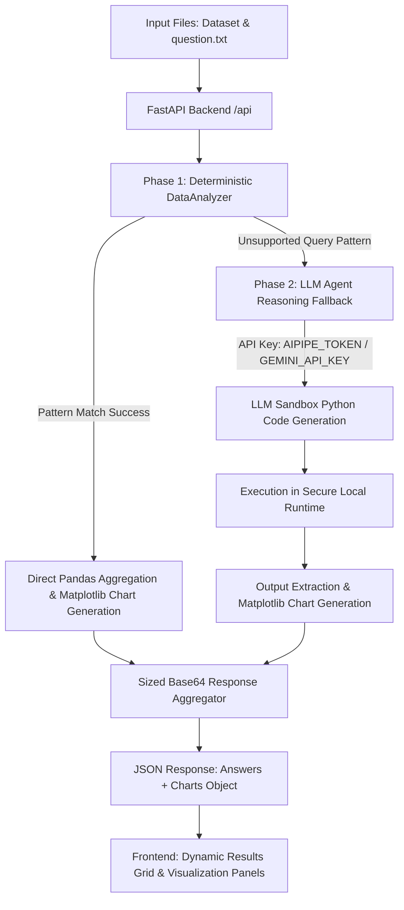

# AI Data Analyst Agent

A premium, developer-focused AI data analyst agent designed to automate complex analytical reasoning, execute sandboxed calculations, and generate production-grade visualizations directly from uploaded datasets.

The system utilizes a dual-phase execution pipeline, combining a fast deterministic analysis engine with a secure LLM-driven runtime fallback.

---

## System Architecture and Execution Flow

The following flowchart outlines how datasets and query files are processed by the system:



---

## Core Capabilities

### 1. Natural Language Analysis
Converts plain English queries into structured analytical instructions. The system matches complex criteria, groups, and filters data programmatically without requiring manual SQL or spreadsheet mapping.

### 2. Automatic Visualizations
Generates high-resolution Matplotlib/Seaborn plots tailored for dark-themed user interfaces. Chart assets are dynamically downscaled and compressed to optimize network payloads and loading speed.

### 3. Python Execution Engine
Calculates advanced statistical metrics, regressions, and aggregations using a secure runtime environment with Pandas and NumPy. This prevents formula syntax limitations common in typical spreadsheets.

### 4. Multi-File Reasoning
Simultaneously evaluates cross-file conditions by ingesting tabular datasets together with text-based directive files, mapping inputs without manual setup.

---

## Technical Specifications

### Tech Stack
* **Backend**: FastAPI, LangChain, Google Generative AI (Gemini Flash/Pro models via OpenRouter or direct API), Pandas, NumPy, Matplotlib, Seaborn.
* **Frontend**: HTML5, CSS3 (Vanilla), JavaScript, GSAP (GreenSock Animation Platform) for smooth stagger-reveal layout animations.

### Supported File Formats
* **CSV**: `.csv`
* **Excel**: `.xlsx`, `.xls`
* **JSON**: `.json`
* **Parquet**: `.parquet`
* **Text**: `.txt`

---

## Getting Started

### Prerequisites
* Python 3.9 or higher
* pip (Python package installer)

### 1. Clone the Repository
```bash
git clone https://github.com/dewanggandhi01/AI-Agent.git
cd AI-Agent
```

### 2. Install Dependencies
```bash
pip install -r requirements.txt
```

### 3. Configure Environment Variables
Create a `.env` file in the root directory:
```ini
# Primary: AI Pipe Token for OpenRouter API access
AIPIPE_TOKEN=your_aipipe_token

# Fallback: Direct Gemini API key
GEMINI_API_KEY=your_gemini_api_key

# Request Configuration
LLM_TIMEOUT_SECONDS=240
```

### 4. Start the Local Server
```bash
python -m uvicorn app:app --port 8000
```
Access the application by navigating to `http://localhost:8000` in your browser.

---

## API Reference

### Access Web Application
* **Method**: `GET`
* **Endpoint**: `/`
* **Response**: Web dashboard interface.

### Submit Analytical Request
* **Method**: `POST`
* **Endpoint**: `/api`
* **Request Format**: `multipart/form-data`
  * `questions_file` (Required): A `.txt` file containing numbered questions.
  * `data_file` (Optional): Tabular dataset file.
* **Response Format**: `application/json`
  ```json
  {
    "Which department has the highest sales?": "Marketing ($450k)",
    "charts": {
      "chart_1": "data:image/png;base64,..."
    }
  }
  ```

---

## Verification & Evaluation

The system is tested using a deterministic validation suite:
1. **validate.py**: Runs local data evaluation matching tabular inputs against `question.txt` directly without incurring LLM API costs.
   ```bash
   python validate.py --questions question.txt --data sales_data.xlsx --output answers.txt
   ```
2. **Quality Gates**: Responses are verified against validation rubrics covering structural JSON parsing, value matching (with numerical tolerance), and chart dimensions/size.

---

## Project Context
Built as an immersive portfolio showcase demonstrating the capabilities of automated data pipelines and LLM-directed program synthesis.

**Developer**: Dewang Gandhi
* CSE B.Tech, ABES Engineering College
* BS Data Science, IIT Madras

---

## License
Licensed under the MIT License – free for personal and commercial use.


  
